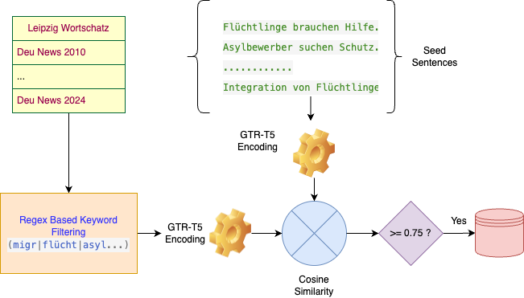
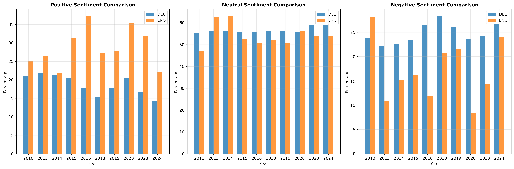

# Diachronic Sentiment Analysis of Migration Discourse (2010–2024)

**Author**: Abdullah Al Sefat  
**Status**: Independent research project  
**Topic**: Natural Language Processing, Computational Social Science, Bias Analysis

---

## 🧠 Overview

This project investigates how sentiment toward *refugees*, *asylum seekers*, and *immigrants* has changed over time in **English** and **German** news media, using sentence-level analysis powered by **GPT-4-mini**.

Using the **Leipzig Corpora Collection** (2010–2024), 26 Million ~+ sentences were filtered to obtain a subset of migration-related sentences and analyzed their sentiment to track evolving societal attitudes across two languages and over 15 years.

---

## 📚 Dataset

- **Corpus**: Leipzig Wortscathz Corpora Collection 
- **Languages**: English (`eng_news_20XX`) and German (`deu_news_20XX`)
- **Time Period**: 2010–2024 (excluding missing years: [2011, 2012, 2021, 2022] for English)
- **Data Format**: One txt file per year containing: *Number* >TAB< *Sentence*

## 🔍 Dataset Filtering Methodology

The raw Leipzig corpora required filtering to isolate migration-relevant content. A two-stage hybrid approach was implemented combining lexical pre-filtering with semantic similarity scoring:

### Semantic Similarity Framework
- **Model**: `sentence-transformers/gtr-t5-large` for high-dimensional sentence embeddings
- **Seed Sentences**: 9 German exemplars covering key migration concepts (*Flüchtlinge*, *Asylbewerber*, *Migration*, etc.)
- **Similarity Metric**: Cosine similarity with threshold ≥ 0.75
- **Processing**: Batch inference (128 sentences) with tensor normalization

### Two-Stage Filtering Pipeline
1. **Lexical Pre-filter**: Regex pattern matching on stemmed German keywords (`migr*`, `flücht*`, `asyl*`, `einwander*`, etc.)
2. **Semantic Validation**: Sentence embeddings compared against seed sentence representations using cosine similarity

This approach ensures both computational efficiency (keyword pre-filtering reduces semantic processing load) and precision (embeddings capture contextual nuances beyond keyword matching). The same methodology was applied to English corpora with translated seed sentences and corresponding English keyword patterns.

## 🤖 Sentiment Classification via LLM Inference

### Model Configuration
- **LLM**: GPT-4-mini via OpenAI API
- **Architecture**: Function calling with structured JSON output schema
- **Batch Processing**: 10 sentences per API call for efficiency and cost optimization
- **Languages**: Bilingual analysis (German and English datasets)

### Sentiment Classification Framework
The prompt was engineered to focus on **attitude bias toward migration groups** rather than situational valence:

**Label Definitions**:
- `positive`: Sympathetic portrayal (deserving help, societal contribution, welcoming)  
- `negative`: Hostile framing (fear, burden, blame toward migrants/refugees/asylum seekers)
- `neutral`: Factual mentions without clear attitudinal bias
- `irrelevant`: Non-migration content (quality control filter)

### Technical Implementation
- **Structured Output**: JSON schema with enum constraints prevents hallucinated labels
- **Batch Inference**: Numbered sentence lists maintain alignment between input and predictions
- **Error Handling**: File existence validation and progressive processing with status tracking
- **Output Format**: Original sentence metadata preserved with appended `sentiment` field

This approach ensures consistent, reproducible sentiment labeling while maintaining computational efficiency through batched API calls and structured response formatting.

## 📊 Results & Analysis

### Key Findings

#### 1. Cross-Linguistic Sentiment Patterns

**German Media Characteristics:**
- Consistently neutral-dominant discourse (~55–60% neutral sentiment)
- Negative sentiment trending upward (17.3% → 26.8%, 2011–2024)
- Positive sentiment declining (25.0% → 14.4%, 2022–2024)

**English Media Characteristics:**
- Higher positive sentiment baseline (22–37% vs German 14–25%)
- More volatile sentiment fluctuations due to smaller sample sizes
- Notable positive spikes during major humanitarian crises (2015, 2020)

#### 2. Temporal Evolution & Event Correlation

**2015 Refugee Crisis Impact:**
- *German*: Moderate negative increase (+3.5pp from 2014)
- *English*: Positive sentiment surge (+10pp), indicating more humanitarian framing

**COVID-19 Period (2020):**
- *German*: Temporary positive recovery (+7.4pp from 2019)
- *English*: Peak positive sentiment (35.4%), suggesting solidarity narratives

**Recent Deterioration (2022–2024):**
- *German*: Sharp negative escalation (+9.3pp increase 2022–2024)
- *English*: Converging toward more polarized patterns

#### 3. Volatility & Structural Shifts

**German Sentiment Volatility:**
- Highest volatility during 2022–2023 (+6.3pp negative shift)
- Structural break around 2018–2019 toward persistently higher negativity
- Brexit/Trump era corresponding with increased negative framing

**English Sentiment Volatility:**
- Event-driven spikes rather than sustained trends
- 2020 humanitarian peak (+13pp positive change from 2019)
- Limited data points constrain trend analysis

### Implications

- German media shows systematic negativization of migration discourse post-2018  
- English media maintains humanitarian framing during crisis periods  
- Temporal correlation with major geopolitical events (refugee crisis, COVID-19, Ukraine war)  
- Linguistic divergence suggests cultural/political differences in migration narratives

